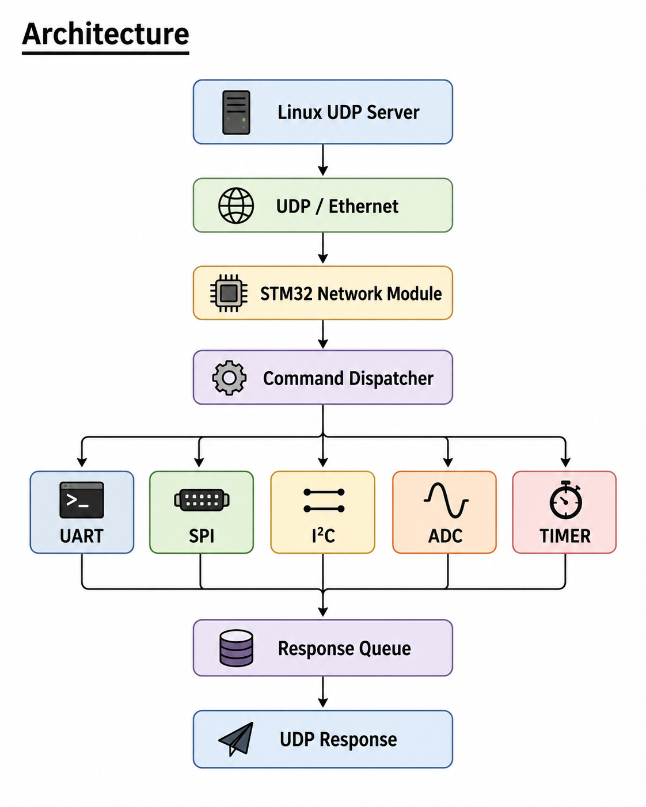
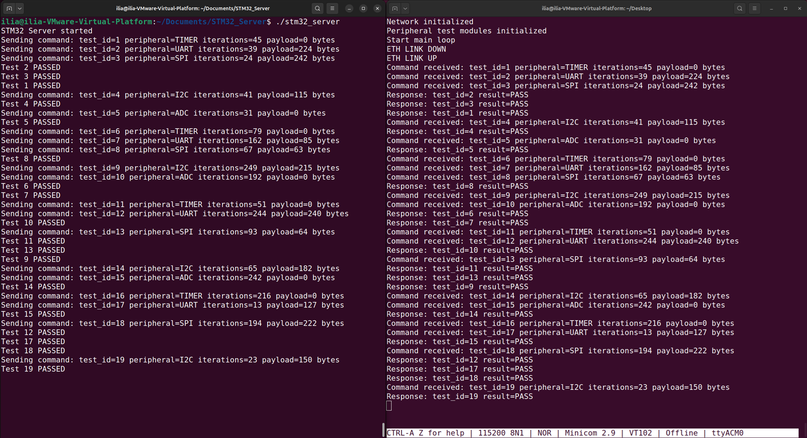
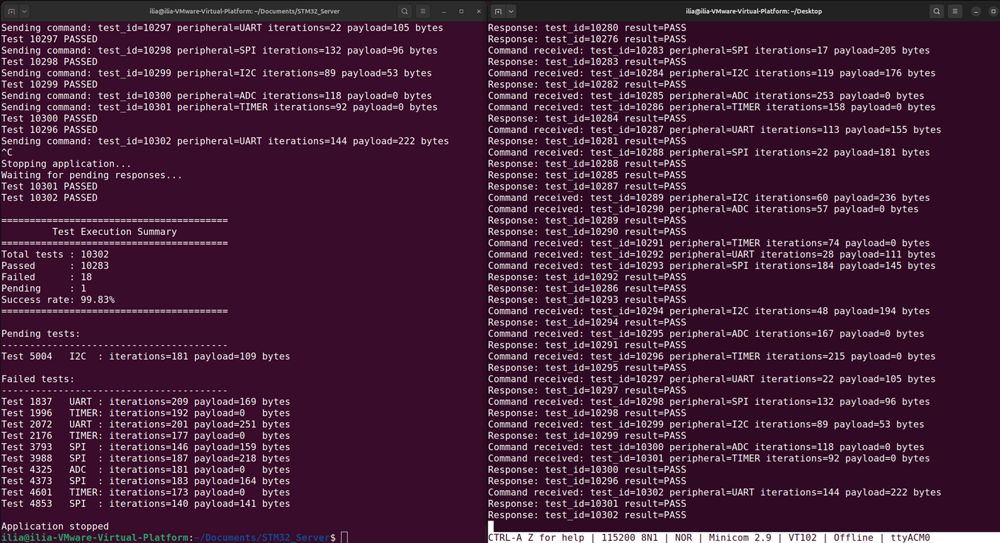
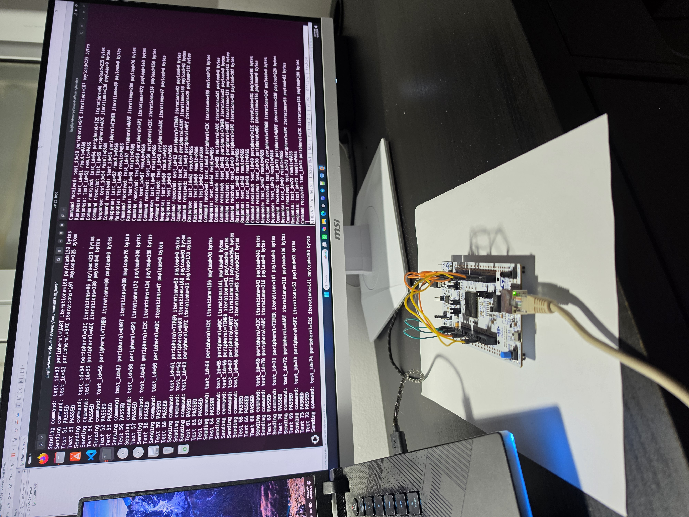

# STM32 Hardware Tester

## [Real Time College](https://rt-ed.co.il/) - a multi-disciplinary Real-Time O.S. and Embedded Software Solutions Center, providing consulting, development, integration, training and support solutions.<br/>

## ARM Embedded Systems Final Project

Course project developed as part of the ARM Embedded Systems course.
The project implements an automated hardware validation system for the STM32F756ZG Nucleo development board. A Linux UDP server generates test commands, sends them to the STM32 board over Ethernet, collects execution results, and displays real-time statistics.
The STM32 firmware executes independent peripheral tests for UART, SPI, I²C, ADC, and Timer modules under FreeRTOS. Multiple tests can run concurrently, demonstrating parallel peripheral verification using a client-server architecture.

---

## Features

- Parallel execution of independent peripheral tests
- FreeRTOS-based firmware architecture
- UDP communication over Ethernet
- Interrupt (IT) and DMA operating modes
- Automatic PASS/FAIL verification
- Random test data generation
- CRC verification for large data packets
- Runtime execution statistics
- SQLite database for test result tracking


## Architecture

The system follows a client-server architecture: the Linux server generates UDP test commands, while the STM32 firmware dispatches them to independent peripheral test modules and sends the results back.




## Hardware Setup

The project was validated on an STM32 Nucleo-F756ZG development board. The peripherals are interconnected using jumper wires to enable UART, SPI, I²C, ADC, and timer self-tests.


## Example Execution

The Linux server continuously generates test commands and sends them to the STM32 board. The firmware executes the requested peripheral tests and returns PASS/FAIL responses through UDP while printing diagnostic information to the serial console.



The application prints a final execution summary including the total number of executed tests, passed tests, failed tests, pending responses, and the overall success rate.




## Hardware Setup

The project was validated on an STM32 Nucleo-F756ZG development board connected to a Linux host via Ethernet and USB.




## Build

### STM32 Firmware

Open the `STM32PeripheralTester` project in **STM32CubeIDE**, select the desired build configuration (**Debug** or **Release**), then build and flash the firmware to the STM32 board.

### Linux Server

Build the Linux application using `make`:

```bash
cd STM32_Server
make
```

The executable `stm32_server` will be generated in the same directory.

Run the server:

```bash
./stm32_server
```


## Author

Ilia Rakhlevski
